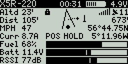
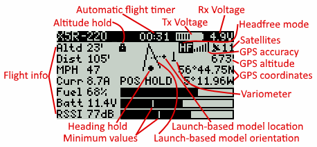
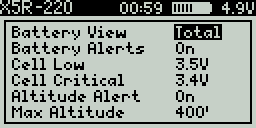

# SmartPort/INAV Telemetry Flight Status - v1.2.2

#### Taranis Q X7

#### Taranis X9D, X9D+ & X9E

## Features

* Launch/pilot-based model orientation and location indicators (great for lost orientation/losing sight of your model)
* Compass-based direction indicator (with compass on multi rotor or fixed wing with GPS)
* Bar gauges for Fuel (% battery mAh capacity remaining), Battery voltage, RSSI strength, Transmitter battery, Variometer (and Altitude for X9D, X9D+ & X9E transmitters)
* Display and voice alerts for flight modes and flight mode modifiers (altitude hold, heading hold, home reset, etc.)
* Voice notifications for % battery remaining (based on current), voltage low/critical, high altitude, lost GPS, ready to arm, armed, disarmed, etc.
* GPS information: Satellites locked, GPS altitude, GPS coordinates
* Display of current/maximum: Altitude, Distance, Speed and Current
* Display of current/minimum: Battery voltage, RSSI strength
* Title display of model name, flight timer, transmitter voltage and receiver voltage
* Manu configuration options can be changed from inside the script
* Speed and distance values are displayed in metric or imperial based on transmitter's telemetry settings

## Requirements

* [OpenTX v2.2.0+](http://www.open-tx.org/) running on Taranis Q X7, X9D, X9D+ or X9E
* SmartPort telemetry receiver: X4R(SB), X8R, XSR, R-XSR, XSR-M, XSR-E, etc. (**not D-series or Crossfire receivers**)
* [INAV v1.7.3+](https://github.com/iNavFlight/inav/releases) running on your flight controller
* GPS

#### Suggested (not required)

* Altimeter (barometer)
* Magnetometer (compass)
* Current sensor

## Setup

#### In INAV Configurator

1. Setup SmartPort telemetry to send to your transmitter - [INAV telemetry docs](https://github.com/iNavFlight/inav/blob/master/docs/Telemetry.md#smartport-sport-telemetry)
2. If you have an amperage sensor (which I highly suggest), configure `battery_capacity` to the mAh you want to draw from your battery and set `smartport_fuel_percent = ON` in CLI settings (allows proper calibration of fuel used percentage)

#### From Transmitter

1. With battery connected and **after GPS fix** [discover telemetry sensors](https://www.youtube.com/watch?v=n09q26Gh858) so all telemetry sensors are discovered
2. Telemetry distance sensor name **must** be changed from `0420` to `Dist` and set to the desired unit: `m` or `ft`
3. The sensors `Dist`, `Alt`, `GAlt` & `Gspd` can be changed to the desired unit: `m` or `ft` / `kmh` or `mph`
4. **Don't** change `Tmp1` or `Tmp2` from Celsius to Fahrenheit! They're not temps, used for flight modes & GPS info

#### INAV Lua Telemetry Screen Setup

1. Download the [Lua Telemetry ZIP file](https://github.com/iNavFlight/LuaTelemetry/archive/master.zip)
2. From the downloaded ZIP file, copy the contents of the `TELEMETRY` folder to the transmitter's SD card's `\SCRIPTS\TELEMETRY\` folder
3. In model setup, page to `DISPLAY`, set desired screen to `Script`, and select `iNav`

## Usage

#### Screen Description

* From transmitter's main screen, long hold the `Page` button to show custom screens, short press `Page` to the iNav screen
* Flashing values indicate a warning (for example: no telemetry, battery low, altitude too high)
* When not armed you can flip between max/min and current values by using the dial or +/- buttons
* To flip between compass-based direction and launch/pilot-based orientation and location, use the dial or +/- buttons
* The launch/pilot-based orientation view is useful if model orientation is unknown
* If model is further than 25 feet away, the launch/pilot-based view will show the direction of the model based on launch/pilot position and orientation (useful to locate a lost model)
* The script gives voice feedback for flight modes, battery levels, and warnings (no need to manually set this up)
* Voice alerts will play in background even if iNav Lua Telemetry screen is not displayed

#### Configuration Settings
When not armed press the `Menu` button to display the configuration options menu:

* **Battery View** - Total battery voltage / Cell voltage average (default: Total)
* **Battery Alert** - Battery alerts on, off, or only critical alerts (default: On)
* **Cell Low** - Cell voltage for low battery warning (default: 3.5V)
* **Cell Critical** - Cell voltage for battery critical warning (default: 3.4V)
* **Altitude Alert** - Turn on or off the altitude alert (default: On)
* **Max Altitude** - Altitude warning starts when over this value (default: 400ft or 120m)
* **Timer** - Show the automatic timer, timer1-3, or turn timer off (default: Auto)
* **Rx Voltage** - Turn on or off the receiver voltage in the title (default: On)
* **Variometer** - Show if model is gaining or decreasing altitude (default: On)
* **Voice Alerts** - Voice alerts on, off, or only critical alerts (default: On)
* **Feedback** - Turn beeper and/or haptic feedback for alerts on or off (default: On)
* **RTH Feedback** - Return to home beeper and haptic feedback on or off (default: On)
* **HF Feedback** - Head free beeper and haptic feedback on or off (default: On)
* **RSSI Feedback** - RSSI beeper and haptic feedback on or off (default: On)

## Tips & Notes

* Between flights (before armed), long-press the Enter/dial and select `Reset telemetry` to reset telemetry values
* Optional (but highly suggested) current sensor needed for fuel and current displays
* Uses transmitter settings for RSSI warning/critical levels for bar gauge range and audio/haptic warnings
* Uses transmitter settings for transmitter voltage min/max for battery bar gauge in screen title
* If you're not getting model distance data, change your telemetry distance sensor name from `0420` to `Dist`
* If you change a telemetry sensor's unit (for example m to ft), power cycle the transmitter to see changes
* INAV v1.8+ is required for `Home reset` voice notification

## Release History

#### v1.2.1 - 12/01/2017
* Lots of new/changed config settings (press `Menu` button to access) - **Please review!**
* Enhanced and cleaned up config menu, centered menu on Q X7 & X9D/+
* Variometer shows if model is gaining or decreasing altitude
* Cell voltage battery view shows with two digits of precision
* Added `S` (South) to X9D/+ directional display
#### v1.2.0 - 11/18/2017
* Lua Telemetry is now pre-compiled to greatly reduce memory (source still available)
* Press `Menu` button (when not armed) to modify user configuration options
* Fixed `FAILSAFE`, `RTH`, `NOT OK` & `NO TELEM` modes to flash as they should
* Barometer and magnetometer are now optional (but suggested for full functionality)
* Headfree indication on Q X7 changed to show directional indicators as dotted lines
* Startup message/version and error if not running OpenTX v2.2.0 or later
#### v1.1.7 - 11/02/2017
* Fix for the default unit type of the `Dist` (`0420`) sensor
#### v1.1.6 - 11/01/2017
* On home reset, reset GPS home position, orientation and distance
* Option to display average battery cell voltage instead of total voltage
* Extra digit for data on X9D & X9D+ transmitters
* Variable cleanup saving memory
#### v1.1.5 - 10/20/2017
* Voice notification for `Home Reset` with INAV v1.8+
* Moved head free warning on Q X7 to top center
* Values convert from decimal to integer when larger to allow for more room
* Better text centering and right justification technique
* Cleaned up code saving more memory
#### v1.1.4 - 10/13/2017
* More accurate max altitude alerts and altitude flashes when above max altitude
* Long-press <Enter> resets values (suggest doing this between flights before armed)
#### v1.1.3 - 10/10/2017
* Shows metric or imperial values based on transmitter telemetry settings
#### v1.1.2 - 10/06/2017
* Lots of refactoring which greatly reduced memory usage
* Re-enabled altitude bar gauge for X9D, X9D+ & X9E transmitters
* Better information layout if no current sensor is present
* Refactored GPS lock calculation to prevent script syntax errors
#### v1.1.1 - 09/28/2017
* Refactored code to reduce memory
* Removed altitude bar gauge for X9D, X9D+ & X9E transmitters (used too much memory?)
#### v1.1.0 - 09/22/2017
* Repo moved to INAVFlight
* Screen formatting for Taranis X9D, X9D+ & X9E
#### v1.0.0 - 09/19/2017
* Initial release

## License

[MIT](https://github.com/iNavFlight/LuaTelemetry/blob/master/LICENSE)